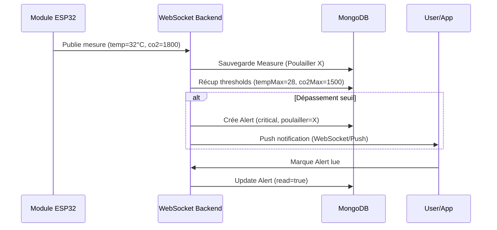
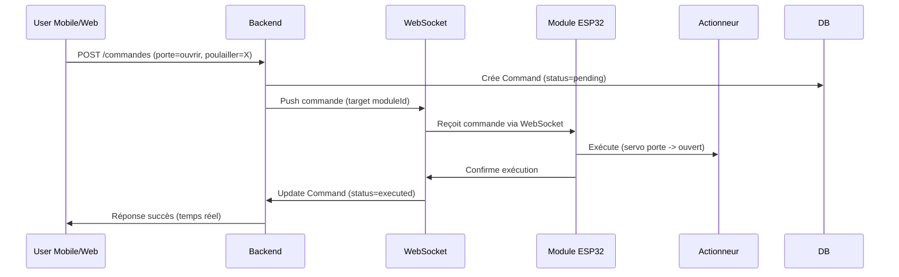

# Diagramme de Classe Global + Diagrammes de Séquence - Sprint 2 : Smart Poultry

## Fonctionnalités Sprint 2

- **Monitoring environnemental** : Mesures capteurs (temp, hum, CO2, NH3, dust, eau)
- **Gestion des seuils & Alertes** : Seuils configurables, alertes automatiques
- **Gestion des utilisateurs (Admin)** : Users eleveur/admin, contrôle accès
- **Commandes & Automatisation** : Commandes actionneurs (porte, ventilation), règles auto

## 1. Diagramme de Classe (Structure statique)

```mermaid
classDiagram
    class User {
        <<entity>>
        +String email
        +String role~'eleveur'/'admin'~
        +Boolean isActive
    }

    class Poulailler {
        <<entity>>
        +String name
        +thresholds : Object
        +actuatorStates : Object
        +String status
    }

    class Module {
        <<entity>>
        +String serialNumber
        +String status
        +Date lastPing
    }

    class Measure {
        <<entity>>
        +Number temperature
        +Number humidity
        +Number co2
        +Date timestamp
    }

    class Alert {
        <<entity>>
        +String parameter
        +Number value
        +String severity
    }

    class Command {
        <<entity>>
        +String typeActionneur
        +String action
        +String status
    }

    class SystemConfig {
        <<singleton>>
        +defaultThresholds : Object
    }

    User ||--o{ Poulailler : "owner"
    Poulailler ||--|| Module : "associated"
    Poulailler ||--o{ Measure : "1"
    Poulailler ||--o{ Alert : "generates"
    Poulailler ||--o{ Command : "1"
    Poulailler ..> SystemConfig : "uses defaults"

    note for Poulailler "Sprint 2: seuils, autoThresholds,\nactuatorStates"
    note for Alert "Auto-générée sur dépassement seuil"
    note for Command "Manuelle ou auto via WebSocket"
```

## 2. Diagramme de Séquence : Mesure et Alerte (Temps réel)



## 3. Diagramme de Séquence : Commande Manuelle



## Instructions d'utilisation

- **VSCode** : Ouvrir MD → Preview (Mermaid auto-rendu).
- **Online** : Copier codes sur [mermaid.live](https://mermaid.live) → Export PNG/SVG.
- **GitHub** : Push → Rendu natif Mermaid.

## Légende

- **ClassDiagram** : Structure BD/relations.
- **Sequence** : Flux dynamiques temps réel (WebSocket).
- **100% Sprint 2** : Monitoring, Alertes, Commandes couvertes.

**Fichiers :** docs/sprint2-diagramme-classe-global.md | TODO.md
