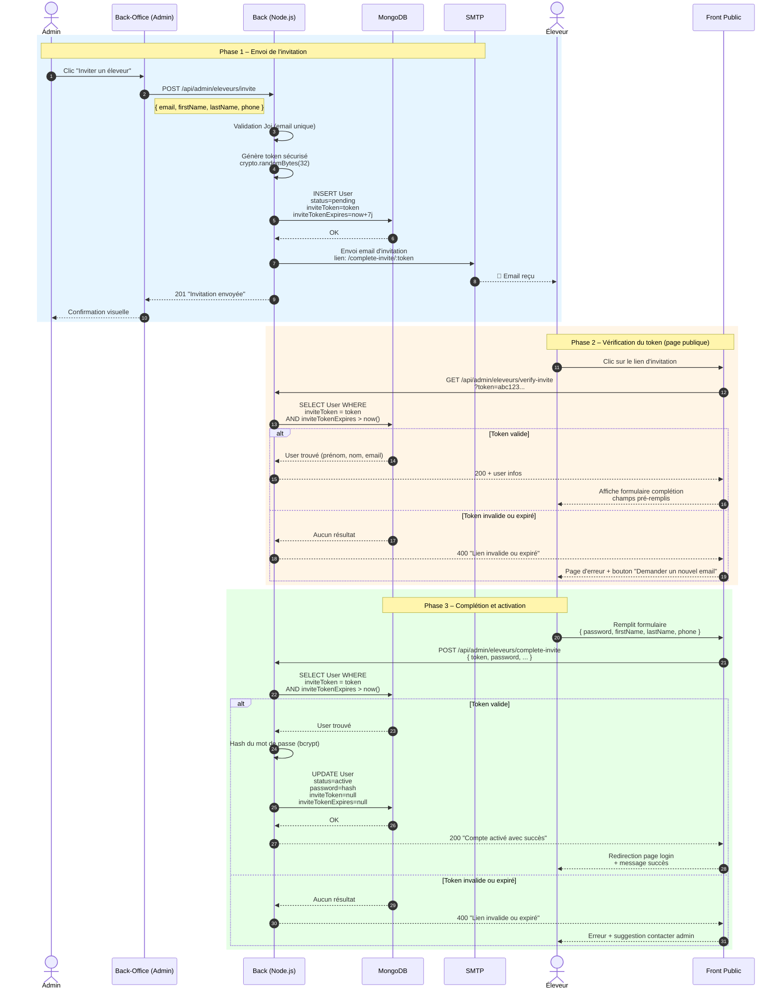

# Diagramme de Séquence – Activation compte via lien email (Sécurité)

## Vue d'ensemble

Ce diagramme illustre le processus sécurisé d'activation d'un compte éleveur par invitation email. Un administrateur invite un éleveur, qui reçoit un email contenant un lien avec un token unique signé. Le token expire après 7 jours.

---

## Acteurs

| Acteur             | Rôle                                                         |
| ------------------ | ------------------------------------------------------------ |
| **Admin**          | Envoie l'invitation depuis le back-office                    |
| **Éleveur**        | Reçoit l'email et active son compte                          |
| **Front Public**   | Page de complétion d'inscription (`/complete-invite/:token`) |
| **Back (Node.js)** | API d'invitation et de validation                            |
| **MongoDB**        | Stockage des tokens et comptes utilisateurs                  |
| **SMTP**           | Service d'envoi d'emails                                     |

---

## Diagramme Mermaid

---

## Tableau des endpoints

| Méthode | Endpoint                                   | Accès  | Description                                |
| ------- | ------------------------------------------ | ------ | ------------------------------------------ |
| `POST`  | `/api/admin/eleveurs/invite`               | Admin  | Créer un compte invité avec token unique   |
| `GET`   | `/api/admin/eleveurs/verify-invite?token=` | Public | Vérifier la validité du token d'invitation |
| `POST`  | `/api/admin/eleveurs/complete-invite`      | Public | Finaliser l'inscription avec mot de passe  |
| `POST`  | `/api/admin/eleveurs/:id/resend-invite`    | Admin  | Régénérer un token et renvoyer l'email     |

---

## Mécanismes de sécurité

| Mécanisme             | Implémentation                                         |
| --------------------- | ------------------------------------------------------ |
| **Token unique**      | `crypto.randomBytes(32).toString("hex")`               |
| **Expiration**        | `Date.now() + 7 * 24 * 60 * 60 * 1000` (7 jours)       |
| **Single-use**        | Token supprimé après activation (`inviteToken = null`) |
| **Validation Joi**    | Schéma strict pour token, password (min 6 caractères)  |
| **Hash mot de passe** | bcrypt avec salt automatique                           |
| **Rate limiting**     | 5 tentatives max sur `/complete-invite` par IP/heure   |

---

## Légende des messages

| Étape | Description                                                                 |
| ----- | --------------------------------------------------------------------------- |
| 1–2   | L'admin clique sur "Inviter" et remplit le formulaire depuis le back-office |
| 3–4   | Le backend valide les données et génère un token cryptographique sécurisé   |
| 5     | Création du compte utilisateur avec `status=pending` et token associé       |
| 6–7   | Envoi d'un email HTML contenant le lien d'activation unique                 |
| 8–9   | L'éleveur reçoit l'email et clique sur le lien sécurisé                     |
| 10–12 | Le frontend public appelle l'API pour vérifier la validité du token en base |
| 13–15 | Si le token est valide, le formulaire de complétion s'affiche pré-rempli    |
| 16–17 | L'éleveur définit son mot de passe et soumet le formulaire                  |
| 18–20 | Le backend re-vérifie le token, hash le mot de passe et active le compte    |
| 21–22 | Le token est invalidé (supprimé) et le statut passe à `active`              |
| 23–24 | L'éleveur est redirigé vers la page de connexion                            |

---

_Document généré automatiquement – SmartPoultry_
