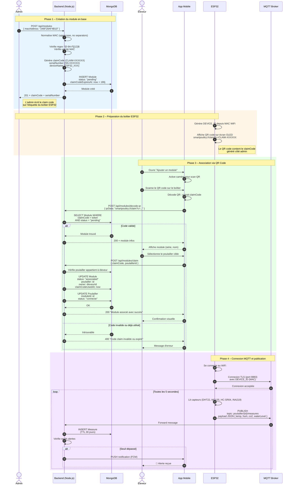

# Diagramme de Séquence – Association ESP32 (Module IoT)

## Vue d'ensemble

Ce diagramme illustre le processus complet d'association d'un module ESP32 à un poulailler : depuis la création du module par l'admin jusqu'à la publication des données MQTT en temps réel.

---

## Acteurs

| Acteur          | Rôle                                                    |
| --------------- | ------------------------------------------------------- |
| **Admin**       | Crée le module en base et génère le claim code          |
| **Éleveur**     | Scanne le QR code sur le boîtier ESP32 via l'app mobile |
| **ESP32**       | Boîtier IoT qui génère un QR code et publie des mesures |
| **App Mobile**  | Application éleveur pour scanner et associer le module  |
| **Backend**     | API Node.js qui gère les modules et l'association       |
| **MongoDB**     | Base de données des modules, poulaillers et users       |
| **MQTT Broker** | Broker HiveMQ pour la communication temps réel          |

---

## Diagramme Mermaid



---

## Tableau des endpoints

| Méthode | Endpoint                      | Rôle    | Description                             |
| ------- | ----------------------------- | ------- | --------------------------------------- |
| `POST`  | `/api/modules`                | Admin   | Créer un module (MAC uniquement)        |
| `POST`  | `/api/modules/decode-qr`      | Éleveur | Valider un QR code scanné               |
| `POST`  | `/api/modules/claim`          | Éleveur | Associer le module à un poulailler      |
| `POST`  | `/api/modules/ping`           | Système | Mettre à jour le dernier ping           |
| `POST`  | `/api/modules/:id/dissociate` | Admin   | Dissocier un module (motif obligatoire) |

---

## Modèle de données – Module (MongoDB)

| Champ                | Type            | Description                                          |
| -------------------- | --------------- | ---------------------------------------------------- |
| `macAddress`         | String (unique) | Adresse MAC normalisée (12 car. hex)                 |
| `serialNumber`       | String          | Numéro de série auto-généré                          |
| `deviceName`         | String          | Nom affiché (ESP32_XXX)                              |
| `status`             | Enum            | `pending` / `associated` / `offline` / `dissociated` |
| `poulailler`         | ObjectId        | Référence vers le Poulailler                         |
| `owner`              | ObjectId        | Référence vers l'Éleveur                             |
| `claimCode`          | String          | Code d'association unique (CLAIM-XXXXXX)             |
| `claimCodeExpiresAt` | Date            | Expiration du claim (180 jours)                      |
| `claimCodeUsedAt`    | Date            | Date d'utilisation du claim                          |
| `lastPing`           | Date            | Dernier signe de vie reçu                            |

---

## Légende des messages

| Étape | Description                                                                                                                                                                            |
| ----- | -------------------------------------------------------------------------------------------------------------------------------------------------------------------------------------- |
| 1–2   | L'admin crée un module en saisissant l'adresse MAC du boîtier ESP32                                                                                                                    |
| 3–4   | Le backend normalise et valide la MAC, puis génère un claimCode, un serialNumber et un deviceName                                                                                      |
| 5–6   | Le module est stocké en base avec `status="pending"` et le claimCode valable 180 jours                                                                                                 |
| 7     | L'admin reçoit les informations du module et écrit le claimCode sur l'étiquette du boîtier                                                                                             |
| 8–9   | L'ESP32 génère son `DEVICE_ID` à partir de son adresse MAC WiFi et affiche un QR code contenant le claimCode                                                                           |
| 10–12 | L'éleveur ouvre l'app mobile, scanne le QR code avec la caméra, et l'app décode le claimCode                                                                                           |
| 13–14 | L'app mobile envoie le claimCode au backend pour validation                                                                                                                            |
| 15–17 | Si le code est valide, l'app affiche les informations du module (série, nom)                                                                                                           |
| 18–19 | L'éleveur sélectionne le poulailler cible dans sa liste et confirme l'association                                                                                                      |
| 20–22 | Le backend vérifie que le poulailler appartient bien à l'éleveur, puis met à jour le module (`status="associated"`) et le poulailler (`status="connecte"`) en une transaction atomique |
| 23–24 | L'éleveur reçoit la confirmation que le module est associé avec succès                                                                                                                 |
| 25–26 | L'ESP32 se connecte au WiFi puis au broker MQTT via TLS sur le port 8883                                                                                                               |
| 27–31 | Toutes les 5 secondes, l'ESP32 lit les capteurs, publie les mesures en JSON sur le topic `poulailler/{id}/measures`, le backend stocke en base et vérifie les seuils d'alerte          |
| 32–33 | Si un seuil critique est dépassé, une notification push est envoyée à l'app mobile de l'éleveur                                                                                        |

---

## Cycle de vie du module ESP32

```
┌─────────────┐     Génération claim      ┌─────────────┐
│   Création  │──────────────────────────▶│   En attente │
│   (admin)   │                           │   (pending)  │
└─────────────┘                           └──────┬──────┘
                                                  │
                       ┌──────────────────────────┘
                       │ Scan QR / Claim
                       ▼
                ┌─────────────┐
                │   Associé   │◄────────────────────────┐
                │ (associated)│                         │
                └──────┬──────┘                         │
                       │                                │
         ┌─────────────┼─────────────┐                  │
         │ Pas de ping │             │ Dissociation     │
         │ > 24h       │             │ (motif obligatoire)
         ▼             │             │                  │
  ┌─────────────┐      │             ▼                  │
  │  Hors ligne │      │      ┌─────────────┐           │
  │  (offline)  │──────┘      │  Dissocié   │───────────┘
  └─────────────┘   Retour    │(dissociated)│  Nouveau claim
                    ping OK   └─────────────┘
```

---

_Document généré automatiquement – SmartPoultry_
