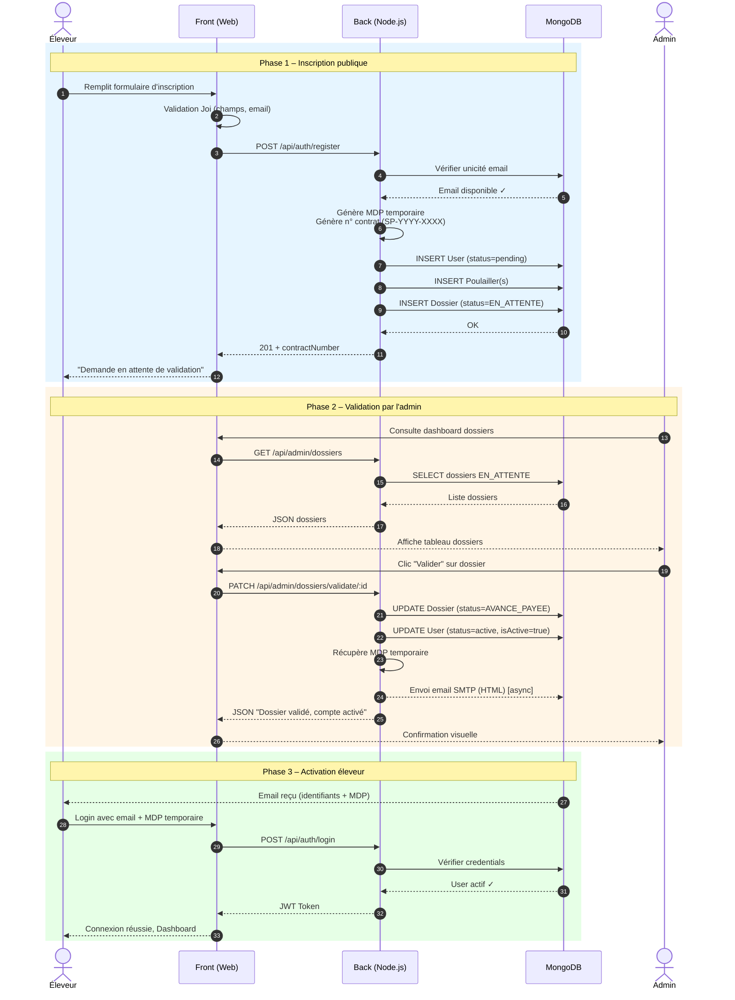

# 🚀 Sprint 1 – Processes Core SmartPoultry

**Objectif :** Mettre en place les processus fondamentaux de gestion des éleveurs, profils, poulaillers et dossiers administratifs.

**Durée :** 2 semaines  
**Focus :** Inscription publique, Gestion de profil, Gestion des poulaillers (Admin), Gestion des dossiers (Admin)

---

## 📋 Table des matières

1. [Processus d'inscription de l'éleveur](#1-processus-dinscription-de-léleveur-sur-la-plateforme-publique)
2. [Gestion de profil](#2-gestion-de-profil)
3. [Gestion des poulaillers – Dashboard Admin](#3-gestion-des-poulaillers--dashboard-admin)
4. [Gestion des dossiers – Partie Admin](#4-gestion-des-dossiers--partie-admin)
5. [Gestion des utilisateurs – Partie Admin](#5-gestion-des-utilisateurs--partie-admin)
6. [Gestion des modules IoT](#6-gestion-des-modules-iot)

---

## 1. Processus d'inscription de l'éleveur sur la plateforme publique

### 1.1 Vue d'ensemble

L'inscription est la porte d'entrée de la plateforme. Un éleveur potentiel remplit un formulaire public qui crée simultanément son compte utilisateur, son (ses) poulailler(s) et son dossier technique en attente de validation admin.

### 1.2 Flux du processus

```
┌─────────────────┐     ┌─────────────────┐     ┌─────────────────┐
│  Formulaire     │────▶│  Validation Joi │────▶│  Création User  │
│  Inscription    │     │  + Unicité email│     │  status=pending │
└─────────────────┘     └─────────────────┘     └────────┬────────┘
                                                         │
                              ┌──────────────────────────┼──────────┐
                              │                          │          │
                              ▼                          ▼          ▼
                        ┌─────────┐               ┌──────────┐ ┌──────────┐
                        │Dossier  │               │Poulailler│ │Poulailler│
                        │EN_ATTENTE               │  N°1     │ │  N°N     │
                        └─────────┘               └──────────┘ └──────────┘
```

### 1.3 Données collectées

| Champ         | Type   | Obligatoire | Validation                       |
| ------------- | ------ | ----------- | -------------------------------- |
| `firstName`   | string | ✅          | `trim().required()`              |
| `lastName`    | string | ✅          | `trim().required()`              |
| `email`       | string | ✅          | `email().lowercase().required()` |
| `phone`       | string | ✅          | `required()`                     |
| `adresse`     | string | ✅          | `required()`                     |
| `poulaillers` | array  | ✅          | `min(1).max(20).required()`      |

**Par poulailler :**

| Champ          | Type   | Obligatoire | Description                    |
| -------------- | ------ | ----------- | ------------------------------ |
| `nom`          | string | ✅          | Nom du bâtiment                |
| `nb_volailles` | number | ✅          | Nombre de sujets (min: 1)      |
| `surface`      | number | ✅          | Surface en m² (min: 1)         |
| `adresse`      | string | ❌          | Adresse spécifique du bâtiment |
| `remarques`    | string | ❌          | Notes libres                   |

### 1.4 Logique métier

1. **Vérification unicité** : L'email ne doit pas exister déjà dans la collection `User`.
2. **Génération mot de passe temporaire** : Mot de passe aléatoire sécurisé (`AAA111@#` format) généré via `crypto.randomInt`.
3. **Calcul densité** : `densite = nb_volailles / surface` (arrondi à 2 décimales).
4. **Numéro de contrat auto** : Format `SP-YYYY-XXXX` (ex: `SP-2025-A3F9`).
5. **Création atomique** : `User` (status=`pending`) + `Poulailler`(s) + `Dossier` (status=`EN_ATTENTE`) en une seule transaction logique.
6. **Réponse API** : Retourne les IDs créés, le nombre total de volailles, la surface totale et le numéro de contrat.

### 1.5 Endpoint API

```http
POST /api/auth/register
Content-Type: application/json

{
  "firstName": "Ali",
  "lastName": "Ben Salah",
  "email": "ali.bensalah@example.com",
  "phone": "+216 20 123 456",
  "adresse": "Route de Tunis, Ben Arous",
  "poulaillers": [
    {
      "nom": "Bâtiment A",
      "nb_volailles": 500,
      "surface": 100,
      "adresse": "Zone industrielle Nord"
    }
  ]
}
```

### 1.6 Réponse succès (201)

```json
{
  "success": true,
  "message": "Demande d'inscription reçue. En attente de validation par l'administrateur.",
  "data": {
    "user": {
      "id": "...",
      "firstName": "Ali",
      "lastName": "Ben Salah",
      "email": "..."
    },
    "poulaillers": [
      { "id": "...", "nom": "Bâtiment A", "nb_volailles": 500, "surface": 100 }
    ],
    "totalVolailles": 500,
    "totalSurface": 100,
    "nbPoulaillers": 1,
    "dossierId": "...",
    "contractNumber": "SP-2025-A3F9"
  }
}
```

### 1.7 Réponse erreurs possibles

| Code | Message                                        | Cause                      |
| ---- | ---------------------------------------------- | -------------------------- |
| 400  | `Cet utilisateur existe déjà`                  | Email déjà enregistré      |
| 400  | Erreur Joi détaillée                           | Champ manquant ou invalide |
| 500  | `Erreur serveur lors de la création du compte` | Erreur DB ou inattendue    |

### 1.8 Règles métier clés

- Un éleveur peut inscrire **1 à 20 poulaillers** en une seule demande.
- Le compte est créé avec `status: "pending"` → l'éleveur **ne peut pas se connecter** tant que l'admin n'a pas validé.
- Le mot de passe temporaire est stocké dans le `Dossier` (champ `motDePasseTemporaire`) et supprimé après validation.
- Email de confirmation envoyé automatiquement à la validation (template HTML responsive).

### 1.9 Diagramme de séquence – Inscription + Validation du dossier (Mermaid)



**Légende des phases :**

| Phase               | Acteurs                     | Description                                                                                                                                                                                                                                                            |
| ------------------- | --------------------------- | ---------------------------------------------------------------------------------------------------------------------------------------------------------------------------------------------------------------------------------------------------------------------- |
| **1 – Inscription** | Éleveur → Front → Back → DB | L'éleveur remplit le formulaire public. Le backend valide les données, vérifie l'unicité de l'email, génère un MDP temporaire et un numéro de contrat, puis crée atomiquement le `User` (status=`pending`), les `Poulailler(s)` et le `Dossier` (status=`EN_ATTENTE`). |
| **2 – Validation**  | Admin → Front → Back → DB   | L'admin consulte la liste des dossiers en attente sur le dashboard, clique sur "Valider". Le backend met à jour le dossier (`AVANCE_PAYEE`), active le compte éleveur (`active`, `isActive=true`) et envoie un email HTML avec les identifiants.                       |
| **3 – Activation**  | Éleveur → Front → Back → DB | L'éleveur reçoit l'email, se connecte avec son email et le MDP temporaire. Le backend vérifie les credentials et retourne un JWT Token. L'éleveur accède à son dashboard.                                                                                              |

---

## 2. Gestion de profil

### 2.1 Vue d'ensemble

Accessible depuis l'application mobile, l'écran de profil permet à l'éleveur de consulter et modifier ses informations personnelles, changer sa photo de profil, basculer en mode sombre et modifier son mot de passe.

### 2.2 Écran mobile – Sections

| Section                       | Fonctionnalités                                          |
| ----------------------------- | -------------------------------------------------------- |
| **Photo de profil**           | Visualisation, changement via galerie ou caméra          |
| **Informations personnelles** | Prénom, Nom, Email (lecture seule), Téléphone            |
| **Paramètres**                | Mode sombre (toggle)                                     |
| **Actions**                   | Modifier le profil, Changer le mot de passe, Déconnexion |

### 2.3 Modifier le profil

**Champs modifiables :**

- `firstName` (obligatoire)
- `lastName` (obligatoire)
- `phone` (optionnel)
- `photoUrl` (optionnel, base64)

**Comportement :**

1. L'utilisateur appuie sur **"Modifier mon profil"** → les champs passent en mode édition.
2. Il peut modifier le texte directement ou changer sa photo via le bouton caméra.
3. Appui sur **"ENREGISTRER"** → appel API `PATCH` avec les nouvelles données.
4. Validation côté client : nom et prénom obligatoires.
5. Retour visuel via Toast (succès / erreur).

**Endpoint :**

```http
PUT /api/auth/updatedetails
Authorization: Bearer <token>

{
  "firstName": "Ali",
  "lastName": "Ben Salah",
  "phone": "+216 20 123 456",
  "photoUrl": "data:image/jpeg;base64,/9j/4AAQ..."
}
```

### 2.4 Changer le mot de passe

**Modal dédié avec 3 champs :**

- Mot de passe actuel
- Nouveau mot de passe
- Confirmer le nouveau mot de passe

**Règles :**

- Tous les champs obligatoires.
- Nouveau mot de passe ≠ confirmation → erreur.
- Mot de passe actuel incorrect → erreur 401.

**Endpoint :**

```http
PUT /api/auth/updatepassword
Authorization: Bearer <token>

{
  "currentPassword": "ancien",
  "newPassword": "nouveau"
}
```

### 2.5 Mode sombre

- Toggle Switch dans la section Paramètres.
- Persistance via `AsyncStorage` (contexte React `ThemeContext`).
- Application immédiate sur tous les écrans de l'app.
- Thèmes définis : `colors` object avec valeurs claires/sombres.

### 2.6 Déconnexion

- Alert de confirmation native (`Alert.alert`).
- Appel à `logout()` → suppression du token et des données locales.
- `navigation.reset()` vers l'écran `Login`.

---

## 3. Gestion des poulaillers – Dashboard Admin

### 3.1 Vue d'ensemble

Le dashboard admin offre une vue centralisée de tous les poulaillers enregistrés sur la plateforme. L'administrateur peut créer, modifier, consulter les détails et archiver (soft delete) un poulailler.

### 3.2 Liste des poulaillers

**Affichage :** Tableau paginé avec colonnes :

- Nom du bâtiment + code unique (`POL-XXXXXX`)
- Type (chair / ponte / dinde / autre)
- Propriétaire (éleveur)
- Nombre de volailles
- Dernières mesures (T°, Humidité)
- Alertes actives
- Statut de connexion (en ligne / hors ligne)
- Dernier ping

**Filtres :**

- Recherche textuelle (nom, code unique, nom/prénom éleveur, email)
- Filtre par statut (`actif`, `en_attente_module`, `alerte`, etc.)
- Pagination serveur (20 éléments par page)

**Endpoint :**

```http
GET /api/admin/poulaillers?search=Ali&status=actif&page=1&limit=20
Authorization: Bearer <admin_token>
```

### 3.3 Ajouter un poulailler

**Processus :**

1. L'admin clique sur "Ajouter un poulailler".
2. Formulaire avec :
   - `name` (obligatoire, min 3 caractères)
   - `type` (chair / ponte / dinde / autre)
   - `animalCount` (nombre de sujets)
   - `ownerId` (sélection de l'éleveur dans une liste déroulante)
3. Génération automatique du `uniqueCode` : format `POL-XXXXXX`.
4. Statut initial : `en_attente_module`.

**Endpoint :**

```http
POST /api/admin/poulaillers
Authorization: Bearer <admin_token>

{
  "name": "Bâtiment B",
  "type": "chair",
  "animalCount": 1200,
  "ownerId": "60d..."
}
```

**Réponse (201) :**

```json
{
  "success": true,
  "message": "Poulailler créé avec succès",
  "data": { "id": "...", "codeUnique": "POL-A3F9B2", "name": "Bâtiment B", ... }
}
```

### 3.4 Modifier un poulailler

**Champs modifiables :**

- `name` (min 3 caractères)
- `type`
- `animalCount`
- `ownerId` (changement de propriétaire)
- `location` (adresse)
- `description`
- `status`
- `isArchived`

**Validation :** Si `ownerId` changé → vérification existence du nouvel éleveur.

**Endpoint :**

```http
PUT /api/admin/poulaillers/:id
Authorization: Bearer <admin_token>

{
  "name": "Bâtiment B – Extension",
  "animalCount": 1500,
  "location": "Nouvelle adresse"
}
```

### 3.5 Supprimer un poulailler (Soft Delete)

- Pas de suppression définitive.
- Le champ `isArchived` passe à `true`.
- Le poulailler disparaît de la liste principale mais reste en base.
- Utile pour conserver l'historique des mesures et alertes.

**Endpoint :**

```http
DELETE /api/admin/poulaillers/:id
Authorization: Bearer <admin_token>
```

**Réponse :**

```json
{
  "success": true,
  "message": "Poulailler archivé avec succès"
}
```

### 3.6 Voir les détails d'un poulailler

**Panneau détail affiché dans un drawer ou modal :**

- Informations du propriétaire
- Seuils configurés (température, humidité, CO2)
- Dernières mesures temps réel
- Historique des alertes actives
- État des actionneurs (porte, lampe, pompe, ventilateur)
- Module IoT associé (si existant)

**Endpoint :**

```http
GET /api/admin/poulaillers/:id
Authorization: Bearer <admin_token>
```

---

## 4. Gestion des dossiers – Partie Admin

### 4.1 Vue d'ensemble

La gestion des dossiers est le cœur du processus commercial. Un dossier lie un éleveur, un poulailler principal, un contrat et un suivi financier (montant total, avance, reste). Le dossier traverse plusieurs statuts jusqu'à sa clôture.

### 4.2 Modèle de données – Dossier

| Champ             | Type                       | Description                                          |
| ----------------- | -------------------------- | ---------------------------------------------------- |
| `eleveur`         | ObjectId (ref: User)       | Propriétaire du dossier                              |
| `poulailler`      | ObjectId (ref: Poulailler) | Poulailler principal                                 |
| `contractNumber`  | String (unique)            | Numéro de contrat auto-généré                        |
| `totalAmount`     | Number                     | Montant total du contrat (DT)                        |
| `advanceAmount`   | Number                     | Avance perçue (DT)                                   |
| `remainedAmount`  | Number                     | Reste à payer (calculé auto)                         |
| `status`          | Enum                       | `EN_ATTENTE` / `AVANCE_PAYEE` / `TERMINE` / `ANNULE` |
| `equipmentList`   | String                     | Liste du matériel prévu                              |
| `dateValidation`  | Date                       | Date de validation                                   |
| `dateCloture`     | Date                       | Date de clôture                                      |
| `motifCloture`    | String                     | Motif de clôture                                     |
| `dateAnnulation`  | Date                       | Date d'annulation                                    |
| `motifAnnulation` | String                     | Motif d'annulation                                   |

### 4.3 Statuts du dossier et transitions

```
                    ┌─────────────┐
                    │  EN_ATTENTE │◄────────────────────────┐
                    └──────┬──────┘                         │
                           │ Valider                         │
                           ▼                                 │
                    ┌─────────────┐     Annuler (motif)     │
           ┌───────►│AVANCE_PAYEE │────────────────────────►│
           │        └──────┬──────┘                         │
           │               │ Clôturer (motif)                │
           │               ▼                                 │
           │        ┌─────────────┐                         │
           │        │   TERMINE   │                         │
           │        └─────────────┘                         │
           │                                                │
           │        ┌─────────────┐                         │
           └────────┤   ANNULE    │◄────────────────────────┘
                    └─────────────┘
```

| Statut         | Couleur    | Signification                                                            |
| -------------- | ---------- | ------------------------------------------------------------------------ |
| `EN_ATTENTE`   | 🟠 Amber   | Dossier créé, en attente de validation admin. Éleveur inactif.           |
| `AVANCE_PAYEE` | 🟢 Emerald | Dossier validé, avance encaissée. Éleveur actif, accès mobile ouvert.    |
| `TERMINE`      | ⚫ Slate   | Dossier clôturé. Installation terminée. Éleveur désactivé. Irréversible. |
| `ANNULE`       | 🔴 Rose    | Dossier annulé. Éleveur désactivé.                                       |

### 4.4 Valider un dossier

**Condition :** Le dossier doit être en statut `EN_ATTENTE`.

**Actions déclenchées :**

1. Le statut passe à `AVANCE_PAYEE`.
2. La date de validation est enregistrée.
3. Le compte éleveur passe à `status: "active"` et `isActive: true`.
4. Le mot de passe temporaire est récupéré et envoyé par email à l'éleveur.
5. Email HTML responsive envoyé avec :
   - Confirmation d'activation
   - Identifiants de connexion (email + mot de passe temporaire)
   - Liste de tous ses poulaillers
   - Conseil de changer le mot de passe à la première connexion.

**Endpoint :**

```http
PATCH /api/admin/dossiers/validate/:id
Authorization: Bearer <admin_token>
```

**Réponse :**

```json
{
  "success": true,
  "message": "Dossier validé avec succès. Compte éleveur activé.",
  "data": { "_id": "...", "status": "AVANCE_PAYEE", "dateValidation": "..." }
}
```

### 4.5 Annuler un dossier

**Conditions :**

- Le dossier ne doit PAS être `TERMINE` (irréversible).
- Un **motif d'annulation** est obligatoire.

**Comportement selon le statut actuel :**

| Statut actuel  | Impact sur l'éleveur    | Message admin                                                |
| -------------- | ----------------------- | ------------------------------------------------------------ |
| `EN_ATTENTE`   | Aucun (déjà inactif)    | "Aucune avance n'avait été perçue"                           |
| `AVANCE_PAYEE` | Désactivation du compte | "Avance à régulariser manuellement. Accès mobile désactivé." |

**Actions déclenchées :**

1. Statut passe à `ANNULE`.
2. Enregistrement du motif et de la date.
3. Si avance perçue → désactivation du compte éleveur (`status: "inactive"`, `isActive: false`).

**Endpoint :**

```http
PATCH /api/admin/dossiers/annuler/:id
Authorization: Bearer <admin_token>
Content-Type: application/json

{
  "motifAnnulation": "Client désisté, projet abandonné"
}
```

### 4.6 Modifier les montants financiers

**Champs modifiables :**

- `totalAmount` (montant total du contrat)
- `advanceAmount` (avance perçue)

**Règles :**

- Le reste est calculé automatiquement : `remainedAmount = totalAmount - advanceAmount`.
- L'avance ne peut pas dépasser le montant total.
- Impossible de modifier si le dossier est `TERMINE` ou `ANNULE`.

**Interface :** 3 champs inline dans le tableau des dossiers :

- Input "Total" (DT)
- Input "Avance" (DT) – fond vert
- Input "Reste" (DT) – fond rouge, lecture seule, calculé auto

**Endpoint :**

```http
PUT /api/admin/dossiers/:id/finance
Authorization: Bearer <admin_token>
Content-Type: application/json

{
  "totalAmount": 7500.00,
  "advanceAmount": 2500.00
}
```

**Réponse :**

```json
{
  "success": true,
  "message": "Finances mises à jour avec succès",
  "data": {
    "totalAmount": 7500.0,
    "advanceAmount": 2500.0,
    "remainedAmount": 5000.0
  }
}
```

### 4.7 Clôturer un dossier

**Condition :** Le dossier doit être en statut `AVANCE_PAYEE`.

**Actions déclenchées :**

1. Statut passe à `TERMINE`.
2. Enregistrement du motif de clôture (obligatoire) et de la date.
3. Désactivation du compte éleveur (`status: "inactive"`, `isActive: false`).
4. L'accès mobile de l'éleveur est fermé.

**⚠️ Attention :** Cette action est **irréversible**.

**Endpoint :**

```http
PATCH /api/admin/dossiers/clore/:id
Authorization: Bearer <admin_token>
Content-Type: application/json

{
  "motifCloture": "Installation terminée, matériel livré et validé par l'éleveur."
}
```

### 4.8 Imprimer le contrat

**Condition :** Le bouton "Contrat" est désactivé si le dossier est `EN_ATTENTE` ou `ANNULE`.

**Contenu du contrat imprimable :**

- En-tête SmartPoultry avec logo
- Numéro de contrat (`contractNumber`)
- Date de génération
- Identité complète de l'éleveur
- Liste détaillée des poulaillers (nom, type, volailles, surface, densité)
- Tableau du matériel IoT fourni (ESP32, capteurs, actionneurs)
- Récapitulatif financier (total, avance, reste)
- Conditions générales
- Espace signature

**Technique :** Composant React `ContratPrint` avec styles CSS print-friendly. Appel via `window.print()` ou génération PDF côté client.

**Bouton UI :**

```
┌─────────────────────────────┐
│  🖨️  Imprimer le contrat    │
└─────────────────────────────┘
```

### 4.9 Tableau de bord des dossiers – Interface Admin

**Barre de filtres par statut :**

| Filtre     | Badge      | Compteur       |
| ---------- | ---------- | -------------- |
| Tous       | Gris       | N total        |
| En attente | 🟠 Amber   | N en attente   |
| Actifs     | 🟢 Emerald | N avance payée |
| Clôturés   | ⚫ Slate   | N terminés     |
| Annulés    | 🔴 Rose    | N annulés      |

**Colonnes du tableau :**

1. **Éleveur** : Nom complet, téléphone, email, adresse, numéro de contrat
2. **Poulaillers** : Nombre de bâtiments, liste compacte (nom, volailles, surface, densité), total
3. **Finances (DT)** : Total, Avance, Reste (avec inputs inline modifiables)
4. **Statut** : Badge coloré + date de création
5. **Actions** : Détails, Imprimer contrat, Valider / Clôturer / Annuler / Supprimer

---

## 📊 Résumé Sprint 1

| Processus                      | User Stories       | Points clés                                                                      |
| ------------------------------ | ------------------ | -------------------------------------------------------------------------------- |
| **Inscription éleveur**        | US-001             | Formulaire public → User + Poulailler(s) + Dossier atomique, status pending      |
| **Gestion de profil**          | US-011, US-012     | Modification infos, photo, mot de passe, mode sombre                             |
| **Gestion poulaillers admin**  | US-Admin-001 à 004 | CRUD poulaillers, codes uniques, recherche, pagination                           |
| **Gestion dossiers admin**     | US-Admin-005 à 009 | Validation, annulation, clôture, modification finances, impression contrat       |
| **Gestion utilisateurs admin** | US-USR-01 à 010    | Liste, invitation éleveur/admin, activation, suppression, complétion inscription |

| Statut du dossier | Action admin possible                                                                        |
| ----------------- | -------------------------------------------------------------------------------------------- |
| `EN_ATTENTE`      | ✅ Valider, ✅ Annuler, ✅ Modifier montants, ❌ Imprimer contrat, ❌ Clôturer               |
| `AVANCE_PAYEE`    | ❌ Valider, ✅ Annuler, ✅ Modifier montants, ✅ Imprimer contrat, ✅ Clôturer               |
| `TERMINE`         | ❌ Valider, ❌ Annuler, ❌ Modifier montants, ✅ Imprimer contrat, ❌ Clôturer               |
| `ANNULE`          | ❌ Valider, ❌ Annuler, ❌ Modifier montants, ❌ Imprimer contrat, ❌ Clôturer, ✅ Supprimer |

---

## 5. Gestion des utilisateurs – Partie Admin

### 5.1 Vue d'ensemble

La gestion des utilisateurs est une fonctionnalité centrale du back-office administrateur. Elle permet de superviser l'ensemble des comptes éleveurs et administrateurs, d'inviter de nouveaux utilisateurs par email, d'activer/désactiver des comptes et de supprimer définitivement des profils. Deux rôles distincts coexistent : **admin** (accès back-office complet) et **eleveur** (accès application mobile uniquement).

### 5.2 Rôles et permissions

| Rôle      | Description                     | Accès                                                                                                                         |
| --------- | ------------------------------- | ----------------------------------------------------------------------------------------------------------------------------- |
| `admin`   | Administrateur de la plateforme | Dashboard admin, gestion des dossiers, gestion des poulaillers, gestion des modules, gestion des utilisateurs, rapports, logs |
| `eleveur` | Éleveur avicole                 | Application mobile : dashboard, alertes, historique, contrôle actionneurs, profil                                             |

### 5.3 Modèle de données – User

| Champ                | Type            | Obligatoire | Description                                    |
| -------------------- | --------------- | ----------- | ---------------------------------------------- |
| `firstName`          | String          | ✅          | Prénom                                         |
| `lastName`           | String          | ✅          | Nom                                            |
| `email`              | String (unique) | ✅          | Email (identifiant de connexion)               |
| `password`           | String          | ✅          | Mot de passe hashé (bcrypt)                    |
| `phone`              | String          | ❌          | Téléphone                                      |
| `role`               | Enum            | ✅          | `admin` / `eleveur`                            |
| `status`             | Enum            | ✅          | `pending` / `active` / `inactive` / `archived` |
| `isActive`           | Boolean         | ✅          | Actif / inactif (contrôle l'accès)             |
| `inviteToken`        | String          | ❌          | Token d'invitation (32 bytes hex)              |
| `inviteTokenExpires` | Date            | ❌          | Date d'expiration du token (7 jours)           |
| `lastLogin`          | Date            | ❌          | Dernière connexion                             |

### 5.4 Liste des utilisateurs

**Interface admin :** Page `/utilisateurs` avec tableau paginé et onglets par rôle.

**Colonnes affichées :**

- Nom complet (prénom + nom)
- Email
- Téléphone
- Rôle (badge Admin / Éleveur)
- Statut (badge Actif / Inactif / En attente)
- Nombre de poulaillers (uniquement pour les éleveurs)
- Dernière connexion
- Date de création
- Actions

**Filtres disponibles :**

- Recherche textuelle (nom, prénom, email)
- Filtre par rôle (tous / admin / éleveur)
- Filtre par statut
- Pagination serveur (20 éléments par page)

**Endpoint :**

```http
GET /api/admin/utilisateurs?search=Ali&role=eleveur&page=1&limit=20
Authorization: Bearer <admin_token>
```

### 5.5 Inviter un nouvel éleveur

**Processus :**

1. L'admin clique sur **"Inviter un utilisateur"**.
2. Sélection du rôle **Éleveur** dans le modal.
3. Formulaire avec :
   - `email` (obligatoire, validation email)
   - `firstName` (optionnel)
   - `lastName` (optionnel)
   - `phone` (optionnel)
4. Génération automatique d'un **token d'invitation** unique (32 bytes hex).
5. Création du compte avec `status: "pending"`, `role: "eleveur"`.
6. Envoi d'un **email d'invitation** contenant un lien vers la page publique de complétion.
7. Le token expire après **7 jours**.

**Réactivation d'un éleveur archivé :** Si l'email existe déjà avec `status: "archived"`, le compte est réactivé (`status → pending`) et un nouveau token est généré.

**Endpoint :**

```http
POST /api/admin/eleveurs/invite
Authorization: Bearer <admin_token>
Content-Type: application/json

{
  "email": "nouveau.eleveur@example.com",
  "firstName": "Mohamed",
  "lastName": "Trabelsi",
  "phone": "+216 21 987 654"
}
```

**Réponse (201) :**

```json
{
  "success": true,
  "message": "Invitation envoyée avec succès",
  "data": {
    "id": "...",
    "email": "nouveau.eleveur@example.com",
    "firstName": "Mohamed",
    "lastName": "Trabelsi",
    "status": "pending"
  }
}
```

### 5.6 Inviter un nouvel administrateur

**Processus :**

1. L'admin clique sur **"Inviter un utilisateur"**.
2. Sélection du rôle **Admin** dans le modal.
3. Formulaire avec :
   - `email` (obligatoire)
   - `firstName` (obligatoire)
   - `lastName` (obligatoire)
   - `phone` (optionnel)
4. Génération du token d'invitation + mot de passe temporaire hashé.
5. Création du compte avec `status: "pending"`, `role: "admin"`.
6. Envoi d'un email d'invitation spécifique au rôle admin.

**Endpoint :**

```http
POST /api/admin/utilisateurs/invite-admin
Authorization: Bearer <admin_token>
Content-Type: application/json

{
  "email": "nouvel.admin@smartpoultry.tn",
  "firstName": "Sami",
  "lastName": "Karray",
  "phone": "+216 20 111 222"
}
```

### 5.7 Compléter l'inscription via invitation (page publique)

**Flux :**

1. L'utilisateur reçoit l'email avec un lien : `https://admin.smartpoultry.tn/complete-invite/:token`
2. La page vérifie la validité du token via API.
3. Si valide → affichage d'un formulaire avec :
   - `firstName` (pré-rempli)
   - `lastName` (pré-rempli)
   - `password` (obligatoire, min 6 caractères)
   - `phone` (optionnel)
4. Soumission → activation du compte (`status → active`, token supprimé).
5. Redirection vers la page de connexion.

**Endpoints publics :**

```http
// Vérifier le token
GET /api/admin/eleveurs/verify-invite?token=abc123...

// Vérifier token admin
GET /api/admin/utilisateurs/verify-admin-invite?token=abc123...

// Compléter l'inscription éleveur
POST /api/admin/eleveurs/complete-invite
Content-Type: application/json

{
  "token": "abc123...",
  "password": "monMotDePasse",
  "firstName": "Mohamed",
  "lastName": "Trabelsi",
  "phone": "+216 21 987 654"
}

// Compléter l'inscription admin
POST /api/admin/utilisateurs/complete-admin-invite
Content-Type: application/json

{
  "token": "abc123...",
  "password": "monMotDePasse",
  "firstName": "Sami",
  "lastName": "Karray",
  "phone": "+216 20 111 222"
}
```

### 5.8 Réenvoyer une invitation

**Condition :** L'utilisateur doit avoir `status !== "active"`.

**Processus :**

1. L'admin clique sur l'icône 🔄 dans la ligne de l'utilisateur.
2. Génération d'un **nouveau token** (l'ancien est écrasé).
3. Nouvelle date d'expiration (+7 jours).
4. Envoi d'un nouvel email.

**Endpoint :**

```http
POST /api/admin/eleveurs/:id/resend-invite
Authorization: Bearer <admin_token>
```

### 5.9 Activer / Désactiver un utilisateur

**Comportement :**

- Basculer le champ `isActive` (toggle).
- Si `isActive = false` → l'utilisateur ne peut plus se connecter.
- Log automatique de l'action (qui a activé/désactivé qui).
- Pour un **éleveur** : appel via `/api/admin/eleveurs/:id/toggle-status`
- Pour un **admin** : appel via `/api/admin/utilisateurs/:id/toggle-status`

**Endpoint éleveur :**

```http
PUT /api/admin/eleveurs/:id/toggle-status
Authorization: Bearer <admin_token>
```

**Endpoint admin :**

```http
PUT /api/admin/utilisateurs/:id/toggle-status
Authorization: Bearer <admin_token>
```

**Réponse :**

```json
{
  "success": true,
  "message": "Utilisateur activé",
  "data": { "id": "...", "isActive": true }
}
```

### 5.10 Mettre à jour un éleveur

**Champs modifiables par l'admin :**

- `firstName`
- `lastName`
- `phone`
- `isActive`

**Endpoint :**

```http
PUT /api/admin/eleveurs/:id
Authorization: Bearer <admin_token>
Content-Type: application/json

{
  "firstName": "Mohamed",
  "lastName": "Trabelsi",
  "phone": "+216 21 000 000",
  "isActive": true
}
```

### 5.11 Supprimer un utilisateur

**Suppression d'un éleveur :** Suppression **définitive** (hard delete). Les poulaillers associés sont également supprimés en cascade.

**Suppression d'un admin :** Suppression **définitive** du compte admin uniquement (pas d'impact sur les poulaillers).

**⚠️ Attention :** Cette action est irréversible.

**Endpoint éleveur :**

```http
DELETE /api/admin/eleveurs/:id
Authorization: Bearer <admin_token>
```

**Endpoint admin :**

```http
DELETE /api/admin/utilisateurs/:id
Authorization: Bearer <admin_token>
```

### 5.12 Obtenir les détails d'un utilisateur

**Endpoint :**

```http
GET /api/admin/utilisateurs/:id
Authorization: Bearer <admin_token>
```

### 5.13 Interface Admin – Page Utilisateurs

**Barre de filtres par rôle :**

| Onglet   | Compteur   | Description                     |
| -------- | ---------- | ------------------------------- |
| Tous     | N total    | Tous les utilisateurs           |
| Éleveurs | N éleveurs | Comptes éleveurs actifs/pending |
| Admins   | N admins   | Comptes administrateurs         |

**Bouton principal :**

```
┌─────────────────────────────┐
│  👤  Inviter un utilisateur │
└─────────────────────────────┘
```

**Actions par ligne :**

| Action               | Icône | Condition                    |
| -------------------- | ----- | ---------------------------- |
| Voir détails         | 👁️    | Toujours                     |
| Réenvoyer invitation | 🔄    | `status !== "active"`        |
| Activer/Désactiver   | 🔓/🔒 | Toujours                     |
| Modifier             | ✏️    | Toujours                     |
| Supprimer            | 🗑️    | Toujours (avec confirmation) |

### 5.14 Récapitulatif des endpoints Utilisateurs

| Méthode  | Endpoint                                        | Rôle   | Description                                       |
| -------- | ----------------------------------------------- | ------ | ------------------------------------------------- |
| `GET`    | `/api/admin/utilisateurs`                       | Admin  | Liste des utilisateurs (tous rôles)               |
| `GET`    | `/api/admin/utilisateurs/:id`                   | Admin  | Détails d'un utilisateur                          |
| `PUT`    | `/api/admin/utilisateurs/:id/toggle-status`     | Admin  | Activer/désactiver un admin                       |
| `DELETE` | `/api/admin/utilisateurs/:id`                   | Admin  | Supprimer définitivement un admin                 |
| `POST`   | `/api/admin/utilisateurs/invite-admin`          | Admin  | Inviter un nouvel administrateur                  |
| `GET`    | `/api/admin/utilisateurs/verify-admin-invite`   | Public | Vérifier token invitation admin                   |
| `POST`   | `/api/admin/utilisateurs/complete-admin-invite` | Public | Compléter inscription admin                       |
| `GET`    | `/api/admin/eleveurs`                           | Admin  | Liste des éleveurs                                |
| `GET`    | `/api/admin/eleveurs/:id`                       | Admin  | Détails d'un éleveur                              |
| `POST`   | `/api/admin/eleveurs/invite`                    | Admin  | Inviter un nouvel éleveur                         |
| `POST`   | `/api/admin/eleveurs/:id/resend-invite`         | Admin  | Réenvoyer une invitation                          |
| `PUT`    | `/api/admin/eleveurs/:id`                       | Admin  | Modifier un éleveur                               |
| `PUT`    | `/api/admin/eleveurs/:id/toggle-status`         | Admin  | Activer/désactiver un éleveur                     |
| `DELETE` | `/api/admin/eleveurs/:id`                       | Admin  | Supprimer définitivement un éleveur + poulaillers |
| `GET`    | `/api/admin/eleveurs/verify-invite`             | Public | Vérifier token invitation éleveur                 |
| `POST`   | `/api/admin/eleveurs/complete-invite`           | Public | Compléter inscription éleveur                     |

### 5.15 User Stories – Gestion des utilisateurs

| ID        | En tant que…       | Je veux…                                                                               | Afin de…                                                    | Priorité    |
| --------- | ------------------ | -------------------------------------------------------------------------------------- | ----------------------------------------------------------- | ----------- |
| US-USR-01 | **Admin**          | Voir la liste complète des utilisateurs (admins + éleveurs) avec filtres et pagination | Avoir une vue d'ensemble de la communauté                   | 🔴 Critique |
| US-USR-02 | **Admin**          | Inviter un nouvel éleveur par email avec un lien sécurisé                              | Lui permettre de créer son compte et accéder à l'app mobile | 🔴 Critique |
| US-USR-03 | **Admin**          | Inviter un nouvel administrateur par email                                             | Déleguer la gestion de la plateforme                        | 🟠 Haute    |
| US-USR-04 | **Éleveur invité** | Compléter mon inscription via une page publique en définissant mon mot de passe        | Activer mon compte et accéder à l'application               | 🔴 Critique |
| US-USR-05 | **Admin**          | Réenvoyer une invitation si le lien a expiré                                           | Permettre à l'utilisateur de finaliser son inscription      | 🟠 Haute    |
| US-USR-06 | **Admin**          | Activer ou désactiver un compte utilisateur en un clic                                 | Gérer les accès sans supprimer les données                  | 🟠 Haute    |
| US-USR-07 | **Admin**          | Modifier les informations d'un éleveur (nom, téléphone, statut)                        | Maintenir les données à jour                                | 🟡 Moyenne  |
| US-USR-08 | **Admin**          | Supprimer définitivement un éleveur et tous ses poulaillers associés                   | Respecter le RGPD et nettoyer les données obsolètes         | 🟠 Haute    |
| US-USR-09 | **Admin**          | Supprimer définitivement un compte administrateur                                      | Gérer les départs de l'équipe                               | 🟡 Moyenne  |
| US-USR-10 | **Système**        | Logger chaque action de création, modification et suppression d'utilisateur            | Auditer les actions des administrateurs                     | 🟡 Moyenne  |

---

## 6. Gestion des modules IoT

### 6.1 Vue d'ensemble

La gestion des modules est le maillon entre le matériel embarqué (ESP32) et la plateforme cloud. Un module représente une carte ESP32 identifiée par son adresse MAC unique. Il traverse un cycle de vie précis : création en base → mise à disposition (code claim) → association à un poulailler → supervision temps réel → éventuelle dissociation.

### 6.2 Modèle de données – Module

| Champ                | Type     | Obligatoire | Description                                          |
| -------------------- | -------- | ----------- | ---------------------------------------------------- |
| `serialNumber`       | String   | ❌          | Numéro de série (`SN-XXXXXX`)                        |
| `macAddress`         | String   | ✅          | Adresse MAC normalisée (12 car. hex, unique)         |
| `deviceName`         | String   | ❌          | Nom affiché (`ESP32_001`, `ESP32_002`…)              |
| `firmwareVersion`    | String   | ❌          | Version du firmware embarqué                         |
| `status`             | Enum     | ✅          | `pending` / `associated` / `offline` / `dissociated` |
| `poulailler`         | ObjectId | ❌          | Référence vers le Poulailler associé                 |
| `owner`              | ObjectId | ❌          | Référence vers l'Éleveur propriétaire                |
| `lastPing`           | Date     | ❌          | Dernier signe de vie reçu (MQTT)                     |
| `claimCode`          | String   | ❌          | Code alphanumérique pour l'association               |
| `claimCodeExpiresAt` | Date     | ❌          | Date d'expiration du code claim (180 jours)          |
| `claimCodeUsedAt`    | Date     | ❌          | Date d'utilisation du code                           |
| `dissociationReason` | String   | ❌          | Motif de dissociation                                |
| `dissociatedAt`      | Date     | ❌          | Date de dissociation                                 |

### 6.3 Cycle de vie d'un module

```
┌─────────────┐     Génération claim      ┌─────────────┐
│   Création  │──────────────────────────▶│   En attente │
│   (admin)   │                           │   (pending)  │
└─────────────┘                           └──────┬──────┘
                                                  │
                       ┌──────────────────────────┘
                       │ Claim / Association
                       ▼
                ┌─────────────┐
                │   Associé   │◄────────────────────────┐
                │ (associated)│                         │
                └──────┬──────┘                         │
                       │                                │
         ┌─────────────┼─────────────┐                  │
         │ Pas de ping │             │ Dissociation     │
         │ > 24h       │             │ (motif obligatoire)
         ▼             │             │                  │
  ┌─────────────┐      │             ▼                  │
  │  Hors ligne │      │      ┌─────────────┐           │
  │  (offline)  │──────┘      │  Dissocié   │───────────┘
  └─────────────┘   Retour    │(dissociated)│  Nouveau claim
                    ping OK   └─────────────┘
```

### 6.4 Statuts du module

| Statut        | Couleur UI | Signification                                                                              |
| ------------- | ---------- | ------------------------------------------------------------------------------------------ |
| `pending`     | 🟠 Orange  | Module créé en base, en attente d'association à un poulailler. Code claim actif.           |
| `associated`  | 🟢 Vert    | Module lié à un poulailler et à un éleveur. Communication active.                          |
| `offline`     | 🔴 Rouge   | Module associé mais aucun ping reçu depuis plus de 24 heures.                              |
| `dissociated` | ⚫ Gris    | Module dissocié du poulailler. Un nouveau code claim est généré pour réassociation future. |

### 6.5 Créer un module

**Qui :** Administrateur uniquement.

**Processus simplifié :**

1. L'admin clique sur **"Ajouter un module"**.
2. Formulaire minimal : saisie de l'**adresse MAC** uniquement (12 caractères hexadécimaux).
3. Le système normalise la MAC (suppression `:` `-` espaces, majuscules).
4. Validation regex : `^[0-9A-F]{12}$`.
5. Création en base avec :
   - `status: "pending"`
   - `deviceName` auto-généré (`ESP32_001`, `ESP32_002`…)
   - `serialNumber` auto-généré (`SN-XXXXXX`)
   - `firmwareVersion` par défaut
6. Un **code claim** unique est généré automatiquement et reste valide **180 jours**.

**Endpoint :**

```http
POST /api/modules
Authorization: Bearer <admin_token>
Content-Type: application/json

{
  "macAddress": "246F28AF4B10"
}
```

**Réponse (201) :**

```json
{
  "success": true,
  "message": "Module créé avec succès",
  "data": {
    "id": "...",
    "serialNumber": "SN-A3F9B2",
    "macAddress": "246F28AF4B10",
    "deviceName": "ESP32_007",
    "firmwareVersion": "1.0.0",
    "status": "pending",
    "claimCode": "CLAIM-X7K9M2",
    "claimCodeExpiresAt": "2025-12-31T23:59:59.000Z"
  }
}
```

**Règles :**

- L'adresse MAC doit être **unique** en base (index unique).
- Si la MAC existe déjà → retourne le module existant avec un **nouveau code claim**.
- Si le module existant était `dissociated`, son statut repasse à `pending`.

### 6.6 Associer un module (Claim)

**Qui :** L'éleveur via l'app mobile (scan QR) ou l'admin via le dashboard.

**Processus :**

1. L'éleveur scanne le **QR code** placé sur le boîtier ESP32.
2. L'app décode le QR et extrait le `claimCode`.
3. L'éleveur sélectionne le poulailler cible dans sa liste.
4. Appel API `claimModule` avec `claimCode + poulaillerId`.
5. Vérifications :
   - Code claim existe et n'a pas été utilisé.
   - Code claim n'est pas expiré.
   - Le poulailler existe et appartient à l'éleveur.
6. **Transaction MongoDB** (session) :
   - `Module` : `status → associated`, `poulailler → id`, `owner → eleveurId`, `claimCodeUsedAt → now`, `installationDate → now`.
   - `Poulailler` : `moduleId → id`, `status → "connecte"`.
7. Confirmation en temps réel sur le dashboard admin.

**Endpoint :**

```http
POST /api/modules/claim
Authorization: Bearer <token>
Content-Type: application/json

{
  "claimCode": "CLAIM-X7K9M2",
  "poulaillerId": "60d..."
}
```

**Réponse :**

```json
{
  "success": true,
  "message": "Module réclamé et associé avec succès",
  "data": {
    "id": "...",
    "status": "associated",
    "poulailler": { "id": "...", "name": "Bâtiment A" },
    "owner": { "id": "...", "name": "Ali Ben Salah", "email": "..." }
  }
}
```

**Erreurs possibles :**
| Code | Message | Cause |
|------|---------|-------|
| 404 | Code claim invalide ou introuvable | Mauvais QR / saisie |
| 400 | Ce code claim a déjà été utilisé | Double scan |
| 400 | Ce code claim a expiré | > 180 jours |
| 404 | Poulailler non trouvé | Mauvais ID |

### 6.7 Dissocier un module

**Qui :** Administrateur uniquement.

**Condition :** Le module doit être en statut `associated` ou `offline` (c'est-à-dire actuellement lié à un poulailler).

**Processus :**

1. L'admin clique sur l'icône de dissociation (🔴) dans la liste des modules.
2. **Modal de confirmation** avec :
   - Avertissement : le module repassera en statut "En attente".
   - Champ **motif** (obligatoire, 10 à 500 caractères).
   - Checkbox de confirmation obligatoire.
3. Actions en base :
   - `Module` :
     - `status → dissociated`
     - `poulailler → null`
     - `owner → null`
     - `dissociationReason → motif`
     - `dissociatedAt → now`
     - **Nouveau `claimCode` généré** automatiquement
     - `claimCodeExpiresAt → now + 180 jours`
     - `claimCodeUsedAt → null`
   - `Poulailler` (ancien) :
     - `moduleId → null`
     - `status → "en_attente_module"`
4. Le module est immédiatement réutilisable pour une nouvelle association.

**Endpoint :**

```http
POST /api/modules/:id/dissociate
Authorization: Bearer <admin_token>
Content-Type: application/json

{
  "reason": "Module remplacé par un ESP32 plus récent suite à panne",
  "confirm": true
}
```

**Réponse :**

```json
{
  "success": true,
  "message": "Module dissocié. Nouveau code claim généré.",
  "data": {
    "id": "...",
    "status": "dissociated",
    "claimCode": "CLAIM-P9M3K7",
    "dissociationReason": "Module remplacé...",
    "dissociatedAt": "2025-06-15T10:30:00.000Z"
  }
}
```

### 6.8 Supprimer un module

**Qui :** Administrateur.

**Condition :** Le module doit être `pending` ou `dissociated`. Un module encore `associated` doit d'abord être **dissocié**.

**Comportement :** Suppression définitive (`findByIdAndDelete`) de la base MongoDB.

**Endpoint :**

```http
DELETE /api/modules/:id
Authorization: Bearer <admin_token>
```

**Réponse :**

```json
{
  "success": true,
  "message": "Module supprimé"
}
```

### 6.9 Supervision temps réel – Ping MQTT

**Mécanisme :**

- L'ESP32 envoie un ping périodique via MQTT au backend.
- Le backend met à jour le champ `lastPing` du module.
- Si `lastPing` date de plus de **24 heures** et que le statut est `associated` → le statut passe automatiquement à `offline` (logique dans `moduleSchema.pre('save')`).
- Dès qu'un nouveau ping arrive sur un module `offline` → le statut repasse à `associated`.

**Endpoint (appelé par le broker MQTT / service interne) :**

```http
POST /api/modules/ping
Content-Type: application/json

{
  "serialNumber": "SN-A3F9B2",
  "macAddress": "246F28AF4B10"
}
```

### 6.10 Interface Admin – Liste des modules

**Tableau paginé avec colonnes :**

| Colonne          | Contenu                                                       |
| ---------------- | ------------------------------------------------------------- |
| **Module**       | Icône + nom (`ESP32_XXX`) + numéro de série                   |
| **Série / MAC**  | `serialNumber` + `macAddress` en monospace                    |
| **Statut**       | Badge coloré (`pending`/`associated`/`offline`/`dissociated`) |
| **Poulailler**   | Nom du bâtiment associé ou "Non associé"                      |
| **Dernier ping** | "à l'instant" / "il y a X min" / "il y a X h" / "il y a X j"  |
| **Actions**      | Associer / Dissocier / Supprimer (selon le statut)            |

**Filtres disponibles :**

- Recherche textuelle (MAC, série, nom)
- Filtre par statut (dropdown)

**Règles d'affichage des actions :**

| Statut        | Actions visibles          |
| ------------- | ------------------------- |
| `pending`     | ✅ Associer, ✅ Supprimer |
| `dissociated` | ✅ Associer, ✅ Supprimer |
| `associated`  | ✅ Dissocier              |
| `offline`     | ✅ Dissocier              |

**Pagination :** 10 modules par page, navigation Précédent/Suivant.

### 6.11 Association via QR Code (Mobile)

**Flux éleveur :**

1. L'éleveur ouvre l'app mobile → section "Ajouter un module".
2. Scan du QR code sur le boîtier ESP32.
3. L'app décode le QR : extrait le `claimCode` (format `smartpoultry://claim?c=CLAIM-XXXX`).
4. Appel API `POST /api/modules/decode-qr` pour valider le code.
5. Si valide → affichage des infos du module (série, nom).
6. L'éleveur choisit le poulailler cible dans sa liste.
7. Appel final `POST /api/modules/claim` pour finaliser l'association.
8. Confirmation visuelle : "Module associé avec succès".

**Endpoint décodage QR :**

```http
POST /api/modules/decode-qr
Authorization: Bearer <token>
Content-Type: application/json

{
  "qrData": "smartpoultry://claim?c=CLAIM-X7K9M2"
}
```

**Réponse :**

```json
{
  "success": true,
  "data": {
    "claimCode": "CLAIM-X7K9M2",
    "serialNumber": "SN-A3F9B2",
    "deviceName": "ESP32_007",
    "status": "pending"
  }
}
```

### 6.12 Récapitulatif des endpoints Module

| Méthode  | Endpoint                           | Rôle            | Description                             |
| -------- | ---------------------------------- | --------------- | --------------------------------------- |
| `GET`    | `/api/modules`                     | Admin / Éleveur | Liste des modules (filtrée par rôle)    |
| `GET`    | `/api/modules/:id`                 | Admin / Éleveur | Détails d'un module                     |
| `POST`   | `/api/modules`                     | Admin           | Créer un module (simplifié, MAC only)   |
| `PUT`    | `/api/modules/:id`                 | Admin           | Modifier un module                      |
| `DELETE` | `/api/modules/:id`                 | Admin           | Supprimer un module (si non associé)    |
| `POST`   | `/api/modules/generate-claim`      | Admin           | Générer un code claim pour un module    |
| `POST`   | `/api/modules/claim`               | Éleveur / Admin | Associer un module à un poulailler      |
| `POST`   | `/api/modules/:id/dissociate`      | Admin           | Dissocier un module (motif obligatoire) |
| `POST`   | `/api/modules/:id/associate`       | Admin           | Associer manuellement (sans code claim) |
| `POST`   | `/api/modules/decode-qr`           | Éleveur / Admin | Valider un QR code                      |
| `POST`   | `/api/modules/ping`                | Système (MQTT)  | Mettre à jour le dernier ping           |
| `GET`    | `/api/modules/pending-poulaillers` | Admin           | Liste des poulaillers sans module       |

---

### 6.13 User Stories du module ESP32

| ID        | En tant que…     | Je veux…                                                                                                      | Afin de…                                                             | Priorité    |
| --------- | ---------------- | ------------------------------------------------------------------------------------------------------------- | -------------------------------------------------------------------- | ----------- |
| US-MOD-01 | **Module ESP32** | Générer mon identifiant unique à partir de mon adresse MAC WiFi                                               | Être reconnu de façon unique par la plateforme cloud                 | 🔴 Critique |
| US-MOD-02 | **Module ESP32** | Me connecter au broker MQTT via TLS sur le port 8883                                                          | Établir une communication sécurisée avec le cloud                    | 🔴 Critique |
| US-MOD-03 | **Module ESP32** | Publier mes mesures capteurs (température, humidité, CO2, niveau d'eau) toutes les 5 secondes                 | Fournir les données temps réel au dashboard éleveur                  | 🔴 Critique |
| US-MOD-04 | **Module ESP32** | Recevoir des commandes de contrôle des actionneurs (porte, lampe, pompe, ventilateur) depuis le cloud         | Exécuter les ordres distants de l'éleveur ou des règles automatiques | 🔴 Critique |
| US-MOD-05 | **Module ESP32** | Gérer automatiquement la porte selon un planning horaire programmé (ouverture/fermeture)                      | Respecter le rythme jour/nuit sans intervention humaine              | 🟠 Haute    |
| US-MOD-06 | **Module ESP32** | Activer automatiquement le ventilateur si la température dépasse le seuil configuré                           | Maintenir la température optimale et prévenir le stress thermique    | 🟠 Haute    |
| US-MOD-07 | **Module ESP32** | Allumer/éteindre automatiquement la lampe selon les horaires programmés                                       | Gérer le photopériode pour le bien-être des volailles                | 🟠 Haute    |
| US-MOD-08 | **Module ESP32** | Activer la pompe d'alimentation en eau lorsque le niveau d'eau est bas                                        | Assurer un approvisionnement constant en eau potable                 | 🟠 Haute    |
| US-MOD-09 | **Module ESP32** | Détecter les fins de course de la porte (ouverture/fermeture complète)                                        | Éviter de forcer le moteur et signaler l'état réel de la porte       | 🟠 Haute    |
| US-MOD-10 | **Module ESP32** | Envoyer un ping de vitalité au cloud à intervalles réguliers                                                  | Signaler que je suis en ligne et fonctionnel                         | 🟠 Haute    |
| US-MOD-11 | **Module ESP32** | Reconnecter automatiquement au WiFi et au broker MQTT en cas de coupure                                       | Assurer la continuité du service sans intervention sur site          | 🟠 Haute    |
| US-MOD-12 | **Module ESP32** | Stocker temporairement les mesures en mémoire NVS si la connexion est perdue                                  | Ne pas perdre de données pendant une panne réseau                    | 🟡 Moyenne  |
| US-MOD-13 | **Module ESP32** | Afficher un QR code contenant mon claim code sur l'écran ou l'étiquette du boîtier                            | Permettre à l'éleveur de m'associer facilement à son poulailler      | 🟠 Haute    |
| US-MOD-14 | **Module ESP32** | Recevoir et appliquer une mise à jour du firmware Over-The-Air (OTA)                                          | Bénéficier des corrections de bugs et nouvelles fonctionnalités      | 🟡 Moyenne  |
| US-MOD-15 | **Module ESP32** | Consommer moins de 5W en fonctionnement normal                                                                | Réduire la facture électrique de l'éleveur                           | 🟢 Basse    |
| US-MOD-16 | **Module ESP32** | Lire les capteurs DHT22 (température/humidité), MQ135 (qualité air), HC-SR04 (niveau eau) et INA219 (courant) | Collecter l'ensemble des données environnementales du poulailler     | 🔴 Critique |
| US-MOD-17 | **Module ESP32** | Chiffrer les données envoyées via TLS/SSL                                                                     | Protéger la confidentialité des données de l'éleveur                 | 🟠 Haute    |
| US-MOD-18 | **Module ESP32** | Gérer les priorités d'exécution : moteur porte (temps réel) > MQTT > capteurs                                 | Réagir instantanément aux fins de course sans latence                | 🔴 Critique |

---

## 📊 Résumé complet Sprint 1

| Processus                      | Fonctionnalités clés                                                                                       | Acteurs                   |
| ------------------------------ | ---------------------------------------------------------------------------------------------------------- | ------------------------- |
| **Inscription éleveur**        | Formulaire public, création atomique User+Poulailler(s)+Dossier, contrat auto                              | Éleveur (public)          |
| **Gestion de profil**          | Modification infos, photo, mot de passe, mode sombre                                                       | Éleveur                   |
| **Gestion poulaillers admin**  | CRUD poulaillers, codes uniques `POL-XXXXXX`, recherche, pagination, soft delete                           | Admin                     |
| **Gestion dossiers admin**     | Validation, annulation, clôture, modification finances (total/avance/reste), impression contrat, 4 statuts | Admin                     |
| **Gestion utilisateurs admin** | Liste, invitation éleveur/admin, activation, suppression, complétion inscription                           | Admin                     |
| **Gestion modules IoT**        | Création MAC, claim code, association/dissociation, ping MQTT, supervision temps réel, QR code             | Admin / Éleveur / Système |

---

_Document Sprint 1 – SmartPoultry_  
_Date : généré automatiquement_  
_Contact : contact@smartpoultry.tn_
